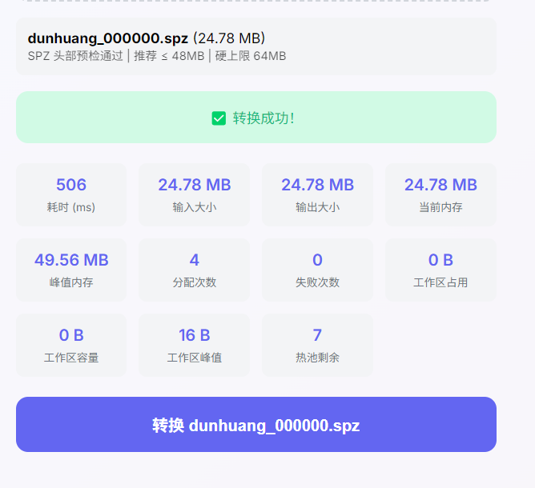

# spz2glb - SPZ to GLB Converter

**Lossless packaging of SPZ into GLB** — preserves SPZ compressed stream, with dual-scenario collaboration: lightweight web usage + heavy local workloads.

## Release Status

- Current stable line: **v2.x** (for exact version, see [Releases](https://github.com/spz-ecosystem/spz2glb/releases) and repository tags)
- Core positioning: **lossless packaging** (SPZ stream stored as-is in GLB)
- Key enhancement: WASM memory/API capabilities (reserved input, explicit release, stats, dual profile)
- Dual-end collaboration: scenario split — browser side for lightweight preview/quick checks, local CLI for heavy conversion, batch jobs, and deep verification
- Validation closure: built-in 3-layer verification (structure/lossless/decoding consistency) + cloud browser smoke

## 📚 Documentation

- **Wiki**: https://github.com/spz-ecosystem/spz2glb/wiki
  - [Installation Guide](https://github.com/spz-ecosystem/spz2glb/wiki/Installation)
  - [Quick Start](https://github.com/spz-ecosystem/spz2glb/wiki/Quick-Start)
  - [Usage](https://github.com/spz-ecosystem/spz2glb/wiki/Usage)
  - [Three-Layer Verification](https://github.com/spz-ecosystem/spz2glb/wiki/Verification)
  - [Batch Processing](https://github.com/spz-ecosystem/spz2glb/wiki/Batch-Processing)
  - [Performance Optimization](https://github.com/spz-ecosystem/spz2glb/wiki/Performance)
  - [Troubleshooting](https://github.com/spz-ecosystem/spz2glb/wiki/Troubleshooting)
  - [FAQ](https://github.com/spz-ecosystem/spz2glb/wiki/FAQ)
  - [Building Guide](https://github.com/spz-ecosystem/spz2glb/wiki/Building)
  - [Contributing](https://github.com/spz-ecosystem/spz2glb/wiki/Contributing)

## Core Features

- **Lossless Packaging**: SPZ compressed stream stored as-is in GLB, 100% byte-level fidelity
- **SPZ_2 Extension**: Uses `KHR_gaussian_splatting_compression_spz_2` standard extension
- **Large-Scale Refactor (v2.0)**: Unified CLI/WASM core path, reduced dual-end divergence
- **WASM Enhancements**: Reserved input, explicit output release, memory stats, compat/perf-lite dual profile
- **Dual-End Collaboration (scenario split)**: lightweight web interaction and fast feedback on browser side; batch, large-file, and heavy verification workflows on local CLI side
- **Three-Layer Verification**: Structure validation / lossless validation / decoding consistency
- **Cross-Platform**: Windows, Linux, macOS (x64 + ARM)
- **Zero Runtime Dependencies**: C++17 + WASM, no additional runtime dependencies

## Comparison with `splat-transform`

> Note: this section describes **tool positioning differences**, not an absolute quality ranking.

### Core Difference in One Line

- **`spz2glb`**: **Lossless packaging** of SPZ into GLB (SPZ compressed stream stored as-is)
- **`splat-transform`**: Reads SPZ, **decompresses and reconstructs** full Gaussian data, then writes GLB (not lossless packaging)

### Detailed Comparison

| Dimension | `spz2glb` (v2.0) | `splat-transform` (v1.10.1) |
|-----------|-------------------|-----------------------------|
| **Core positioning** | **Lossless SPZ→GLB packaging** (preserves SPZ compressed stream) | **Data transformation/reconstruction tool** (multi-format conversion & editing) |
| **SPZ handling** | No decompression; SPZ stored as binary stream inside GLB | Read SPZ → decompress to full Gaussian data → rebuild GLB |
| **GLB output** | Uses `KHR_gaussian_splatting_compression_spz_2` extension with original SPZ stream | Uses standard `KHR_gaussian_splatting` extension with decompressed Gaussian attributes |
| **Data fidelity** | 100% lossless (byte-level SPZ preservation) | Decompress-rebuild cycle involves codec conversion |
| **Feature scope** | Focused on SPZ↔GLB conversion and verification | Supports read/transform/filter/merge/generate across PLY/SOG/SPZ/KSPLAT/SPLAT formats |
| **Runtime** | C++17 + WASM, no runtime dependencies | TypeScript/Node.js with WebGPU dependency for SOG compression |
| **WASM capabilities** | Reserved input, explicit release, memory stats, dual profile | Browser/Node dual-end, not centered on release-grade memory governance |
| **Validation** | Built-in 3-layer verification (structure/lossless/decoding consistency) + cloud browser smoke | Unit tests + fixture validation |

### Usage Recommendations

| Scenario | Recommended Tool |
|----------|------------------|
| Need to **losslessly embed** SPZ in GLB, preserving original compression | `spz2glb` |
| Need GLB with directly renderable Gaussian data (not compressed stream) | `splat-transform` |
| Need splat transformation, filtering, merging, generation | `splat-transform` |
| Need cross-format batch processing (SOG/KSPLAT/SPLAT/etc.) | `splat-transform` |
| Need dual-scenario collaboration (lightweight web + heavy local tasks) with release-grade validation | `spz2glb` |

### Basic Conversion

```bash
# Convert SPZ to GLB
spz2glb model.spz model.glb
```

### Three-Layer Verification

```bash
# Run all verifications (provide your own SPZ and GLB files)
spz_verify all input.spz output.glb

# Output:
# Layer 1: GLB Structure & SPZ_2 Specification Validation - PASSED (7/7)
# Layer 2: Binary Lossless Verification - PASSED (100% MD5 match)
# Layer 3: Decoding Consistency Verification - PASSED (Size match)
# [SUCCESS] All verifications PASSED!
```

> **Note**: Use the actual executable path from your build output (for example `build/spz2glb` / `build/spz_verify`) or add binaries to `PATH`.

### Batch Processing

```bash
# Batch convert all SPZ files
for file in *.spz; do
    spz2glb "$file" "${file%.spz}.glb"
done
```

## Quick Start

### Option 1: Download Pre-compiled Binaries

Download binaries for your platform from [Releases](https://github.com/spz-ecosystem/spz2glb/releases):

- Windows: `spz2glb-windows-x64.exe`
- Linux: `spz2glb-linux-x64`
- macOS: `spz2glb-macos-x64`

### Option 2: Build from Source (One-Click Build)

```bash
# 1. Clone the repository
git clone https://github.com/spz-ecosystem/spz2glb.git
cd spz2glb

# 2. One-click build (handles all dependencies automatically)
cmake -B build -DCMAKE_BUILD_TYPE=Release
cmake --build build --config Release -j$(nproc)

# 3. Run (use actual binary path or PATH command)
spz2glb input.spz output.glb
```

**Platform-Specific Dependencies** (install before building):

```bash
# Ubuntu/Debian
sudo apt-get install -y zlib1g-dev

# macOS
brew install zlib

# Windows
# No manual installation required, CI uses vcpkg to install automatically
```

## Usage

### Converter (spz2glb)

```bash
spz2glb <input.spz> <output.glb>
```

**Complete Examples**:

```bash
# Convert a single file
spz2glb model.spz model.glb

# Batch conversion
for file in *.spz; do
    spz2glb "$file" "${file%.spz}.glb"
done
```

**Output Example**:

```
[INFO] Loading SPZ: model.spz
[INFO] SPZ version: 2
[INFO] Num points: 100000
[INFO] SH degree: 3
[INFO] SPZ size (raw compressed): 15 MB
[INFO] Creating glTF Asset with KHR extensions
[INFO] Exporting GLB...
[SUCCESS] GLB exported: model.glb
[INFO] GLB size: 16 MB
```

### Three-Layer Verification Tool (spz_verify)

> **Important Notes**:
> - **Independent Tool**: spz_verify is a standalone verification tool, NOT part of the production conversion pipeline
> - **Development/Testing Use**: Designed for quality assurance, debugging, and testing workflows
> - **Not Required for Daily Use**: Once conversion is verified, you only need spz2glb for production
> - **Layer 2 Performs Decompression**: Layer 2 verification extracts and decompresses data to compute MD5 hashes (slower than Layer 1/3)

```bash
spz_verify <command> [options]
```

**Commands**:

```bash
# Run all three layers of verification
spz_verify all <input.spz> <output.glb>

# Run individual layer verification
spz_verify layer1 <output.glb>              # GLB structure validation (fast)
spz_verify layer2 <input.spz> <output.glb>  # Lossless binary validation (MD5, slower)
spz_verify layer3 <input.spz> <output.glb>  # Decode consistency validation (fast)
```

**Complete Examples**:

```bash
# 1. Convert file
spz2glb model.spz model.glb

# 2. Run all verifications
spz_verify all model.spz model.glb

# Or verify individually
spz_verify layer1 model.glb
spz_verify layer2 model.spz model.glb
spz_verify layer3 model.spz model.glb
```

**Verification Output**:

```
Layer 1: GLB Structure Validation
  ✓ Magic number: 0x46546C67 ("glTF")
  ✓ Version: 2
  ✓ extensionsUsed contains KHR_gaussian_splatting
  ✓ extensionsUsed contains KHR_gaussian_splatting_compression_spz_2
  ✓ buffers configuration correct
  ✓ Compression stream mode (attributes empty)
  [PASS] Layer 1 validation passed

Layer 2: Lossless Binary Validation
  ✓ Original SPZ MD5: abc123...
  ✓ Extracted data MD5: abc123...
  ✓ MD5 match confirmed
  [PASS] Layer 2 validation passed

Layer 3: Decode Consistency Validation
  ✓ GLB structure valid
  ✓ Extension integrity check passed
  [PASS] Layer 3 validation passed

[SUCCESS] All 3 layers validation passed!
```

## Automated Verification Script (Recommended)

Create `verify.sh` or `verify.bat` script to automate conversion + verification:

**Linux/macOS** (`verify.sh`):

```bash
#!/bin/bash
set -e

if [ $# -ne 1 ]; then
    echo "Usage: $0 <input.spz>"
    exit 1
fi

INPUT="$1"
OUTPUT="${INPUT%.spz}.glb"
SPZ2GLB="spz2glb"
VERIFY="spz_verify"

echo "=== SPZ to GLB Conversion & Verification ==="
echo "Input:  $INPUT"
echo "Output: $OUTPUT"
echo ""

# Step 1: Convert
echo "[1/2] Converting SPZ to GLB..."
$SPZ2GLB "$INPUT" "$OUTPUT"
echo ""

# Step 2: Verify
echo "[2/2] Running 3-layer verification..."
$VERIFY all "$INPUT" "$OUTPUT"
echo ""

echo "=== Complete ==="
```

**Windows** (`verify.bat`):

```batch
@echo off
setlocal enabledelayedexpansion

if "%~1"=="" (
    echo Usage: %~0 ^<input.spz^>
    exit /b 1
)

set INPUT=%~1
set OUTPUT=%INPUT:.spz=.glb%
set SPZ2GLB=build\spz2glb.exe
set VERIFY=build\spz_verify.exe

echo === SPZ to GLB Conversion ^& Verification ===
echo Input:  %INPUT%
echo Output: %OUTPUT%
echo.

echo [1/2] Converting SPZ to GLB...
%SPZ2GLB% "%INPUT%" "%OUTPUT%"
echo.

echo [2/2] Running 3-layer verification...
%VERIFY% all "%INPUT%" "%OUTPUT%"
echo.

echo === Complete ===
```

**Using the Script**:

```bash
# Linux/macOS
chmod +x verify.sh
./verify.sh model.spz

# Windows
verify.bat model.spz
```

## WebAssembly Build

### Build WASM Version

```bash
# Install Emscripten
git clone https://github.com/emscripten-core/emsdk.git
cd emsdk
./emsdk install latest
./emsdk activate latest
source ./emsdk_env.sh

# Build WASM modules
cd tools/spz_to_glb
emcmake cmake -B build_wasm -DSPZ2GLB_BUILD_WASM=ON -DSPZ2GLB_USE_EMSCRIPTEN_ZLIB=ON
emmake cmake --build build_wasm --config Release --target spz2glb-wasm
emmake cmake --build build_wasm --config Release --target spz_verify-wasm

# Output in build_wasm/dist/ (exact files depend on profile/toolchain)
# - spz2glb.js, spz2glb.wasm
# - spz_verify.js, spz_verify.wasm
# - optional side files may appear; deploy files from the same build together
```

### Web Usage

**Important**: Keep `spz2glb.js` and `spz2glb.wasm` from the same build output in the same directory and load via HTTP server. If your build also produces side files, deploy them together with the same version set.

### JavaScript API

```javascript
import { loadSpz2Glb } from './spz2glb_bindings.js';

const api = await loadSpz2Glb('./spz2glb.wasm');
const result = api.convert(spzUint8Array);

if (!result) throw new Error('Conversion failed');

const glbBytes = result.bytes;        // Uint8Array view on WASM memory
const glbBlob = result.toBlob('model/gltf-binary');
const stats = api.getMemoryStats();
console.log('Peak MB:', (stats.peakUsageBytes / 1024 / 1024).toFixed(2));

result.release(); // Required: release WASM output buffer
```

> Note: `spz_verify` is currently provided as CLI/WASM artifact for verification workflows. The README does not claim a stable browser JS API surface for it.

### WASM Memory Configuration

| Profile | INITIAL_MEMORY | ALLOW_MEMORY_GROWTH | MAXIMUM_MEMORY | Description |
|---------|----------------|---------------------|----------------|-------------|
| `compat` | 64MB | `1` | 1GB | Better compatibility on diverse devices |
| `perf-lite` | 128MB | `0` | N/A | Stable memory ceiling for light/medium files |

### Smart Memory Allocation (Browser + WASM)

The smart memory strategy is a 3-layer pipeline, not a single fixed threshold:

1. **Device tiering**: classify device capability (low/medium/high) from `navigator.deviceMemory`, `hardwareConcurrency`, and UA.
2. **File budgeting**: compute `recommendedMaxFileSize` and `hardMaxFileSize` from tier + browser heap limits (e.g. high tier defaults to 64MB hard cap).
3. **WASM-side reservation**: reserve one contiguous input region (`reserve_input`), stream file chunks into it, run `convert_reserved_input`, then explicitly release output buffers.

Goal: maximize stability across devices (avoid OOM/browser stalls) while keeping memory telemetry visible (current/peak usage, failures, workspace usage).

### Why WASM64 (memory64) is not enabled by default

`WASM64` is intentionally not enabled by default for stability/compatibility reasons:

- **ABI contract**: current JS bindings + C API assume 32-bit `size_t` (`size_t == 4`); switching to memory64 would break ABI expectations.
- **Browser/toolchain consistency**: the memory64 ecosystem is improving but still less uniform than wasm32 across browser versions/toolchains.
- **Product scope fit**: browser mode in this project targets lightweight preview and quick conversion; current wasm32 limits + compat profile are sufficient for this scope.

If large-file browser processing becomes a hard requirement, a separate WASM64 build target can be evaluated while preserving backward compatibility.

### Performance Optimizations

The WASM build includes:
- **-O3 + strict warnings**: Optimized build with warning-clean gate
- **-fno-exceptions**: No exception overhead
- **compat/perf-lite dual profile**: Configurable memory behavior by runtime target
- **Memory pool**: Bump allocator for fast allocation
- **Hot object pool**: Fixed-size object reuse

> Example: `dunhuang_000000.spz` (24.78 MB) converts successfully in browser in about `506 ms`, with peak memory around `49.56 MB`.



## Dependencies

- CMake 3.15+
- C++17 compiler
- ZLIB (automatically installed via system package manager)

**Dependency Details**:

| Tool | Dependencies | Purpose |
|------|--------------|---------|
| spz2glb | ZLIB, fastgltf, simdjson | SPZ to GLB conversion |
| spz_verify | ZLIB only | Three-layer verification |

## Project Structure

```
spz2glb/
├── CMakeLists.txt              # Build configuration
├── LICENSE                     # MIT License
├── README.md / README-zh.md    # Documentation
├── src/
│   ├── spz2glb_core.cpp/.h     # Core conversion logic (v2.0 unified entry)
│   ├── spz2glb_wasm_c_api.cpp/.h  # WASM C API (reserve/release/stats)
│   ├── memory_pool.cpp/.h      # Memory pool and hot object pool
│   ├── spz_to_glb.cpp          # CLI main entry
│   ├── spz_verify.cpp          # Verification tool main entry
│   ├── spz_verifier.cpp/.h     # Three-layer verification implementation
│   └── base64.{h,cpp}          # Base64 codec
├── third_party/                # Customized fastgltf + simdjson
│   ├── include/fastgltf/
│   ├── src/
│   └── deps/simdjson/         # simdjson v4.3.1 (built-in)
├── tests/                      # Test scripts and fixtures
└── .github/workflows/          # CI/CD workflows
```

## Technical Details

### Compression Stream Mode

This tool uses SPZ_2 specification compression stream mode:
- SPZ compressed data stored directly in bufferView
- No accessors or attributes defined
- Requires renderer with SPZ decoder to parse

**Advantages**:
- **Lossless**: No re-encoding, direct copy of SPZ stream
- **Minimal Size**: SPZ compression ratio ~10x
- **Fastest Loading**: No additional codec overhead

**Compatibility Note**:
> Any SPZ-derived algorithm that is 100% compatible with the original SPZ format and strictly follows the SPZ_2 extension specification is perfectly supported by this converter.

### GLB Structure

```
GLB Header (12 bytes)
├── magic: 0x46546C67 ("glTF")
├── version: 2
└── length: total file size

JSON Chunk
├── chunkLength
├── chunkType: 0x4E4F534A ("JSON")
└── glTF JSON (padded to 4-byte boundary)
    └── KHR_gaussian_splatting_compression_spz_2 extension

BIN Chunk
├── chunkLength
├── chunkType: 0x004E4942 ("BIN\0")
└── Raw SPZ compressed data
```

## Author & Copyright

- Copyright owner: **Pu Junhan**
- Start year: **2026**

## Independent Work Statement

This project is developed independently by the author in their personal capacity and is not affiliated with any university, institution, or employer.

This project depends on the following public technical specifications:
- SPZ file format (Niantic, Inc.)
- glTF 2.0 / KHR_gaussian_splatting (Khronos Group)
- KHR_gaussian_splatting_compression_spz_2 extension draft (SPZ ecosystem public specification)

This project is not affiliated with, endorsed by, or connected to Niantic, Inc. or its affiliates.

## License

MIT License - See [LICENSE](LICENSE) for details

## Ecosystem Position

`spz2glb` is a **downstream project in the SPZ ecosystem**. Its relationship with the upstream `spz_gatekeeper` is:

- **Gatekeeper (upstream)**: Defines and enforces SPZ format legality, extension compatibility, and governance standards (L2 validation, TLV extension registry, compliance auditing).
- **`spz2glb` (downstream)**: Performs lossless packaging of compliant SPZ files into GLB, adhering to the compatibility constraints defined by the gatekeeper.

> In short: **gatekeeper governs "admission and standards"; `spz2glb` handles "conversion and delivery."**

Related projects:

- [spz_gatekeeper](https://github.com/spz-ecosystem/spz_gatekeeper) - SPZ Gatekeeper: format legality validation and ecosystem governance
- [fastgltf](https://github.com/spnda/fastgltf) - High-performance glTF library (by Sean Apeler, MIT License)
- [simdjson](https://github.com/simdjson/simdjson) - Ultra-fast JSON parsing library v4.3.1
- [KHR_gaussian_splatting](https://github.com/KhronosGroup/glTF/tree/main/extensions/2.0/Khronos/KHR_gaussian_splatting) - Khronos Gaussian Splatting Extension

## Customization Notes

This project uses a **customized version of fastgltf** with the following modifications:

1. **simdjson v4.3.1 Built-in**: Does not search for system libraries, does not download from network, uses built-in source code
2. **KHR_gaussian_splatting_compression_spz_2 Extension**: Supports SPZ_2 compression format
3. **One-Click Build**: Just `cmake && cmake --build`, no manual dependency configuration required
